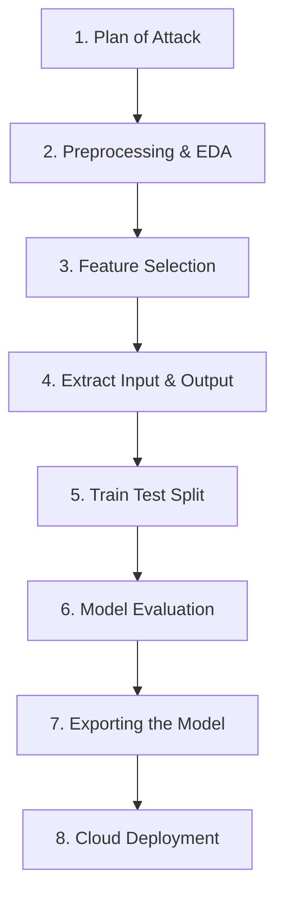

# My-first-ML-Project-
This ML project basically take CGPA and IQ of the student and tell us if the student will get a placement or not.

# Student Placement Prediction Model

An end-to-end Machine Learning project designed to predict student placement status based on academic performance. The project implements a complete binary classification pipeline leveraging data cleaning, feature analysis, and deployment-ready model packaging.

## Workflow Pipeline

This project was built following a highly structured engineering layout to ensure repeatable training and seamless production delivery:

---

## 🛠️ Step-by-Step Implementation

### 1. Plan of Attack
Before initiating development, a structured roadmap was outlined:
*   **Problem Intent:** Predict binary placement outcomes (`1` for Placed, `0` for Not Placed).
*   **Feature Scope:** Isolate predictive strength using key baseline metrics (**CGPA** and **IQ**).
*   **Operational Goals:** Train a classification model, evaluate correctness via accuracy limits, and store the output pipeline for cloud processing.

### 2. Preprocessing & EDA
Data cleaning was completed to remove indexing noise (such as dropping the arbitrary `Unnamed: 0` column) and examine the dataset structural properties using `df.info()` and `df.shape`.

#### Scatterplot Example
To verify whether the problem space was linearly separable, a descriptive scatterplot was mapped using `matplotlib`.

### 3. Feature Selection
For this baseline release, the focus was centered strictly on raw operational criteria:
*   **Dropped Features:** Removed structural anomalies like record indices that lack statistical variance.
*   **Selected Features:** Retained `cgpa` and `iq` as the essential predictive components.

### 4. Extracting Input and Output Columns
The dataset matrix was partitioned to divide structural attributes from target prediction variables.

### 5. Train Test Split
To prevent data leakage and properly evaluate generalized predictive behaviors, the underlying data vectors were separated into training fractions and validation segments using `scikit-learn`.

### 6. Evaluating the Model
A **Logistic Regression** is fit against our localized matrices to construct optimal classification boundaries.

#### Accuracy Score
Model validation checks are verified directly through exact classification correctness ratings.

### 7. Exporting the Model
Following algorithmic parameter calculations, the final system state and scaling parameters are locked into serialized binary streams via `pickle`.
